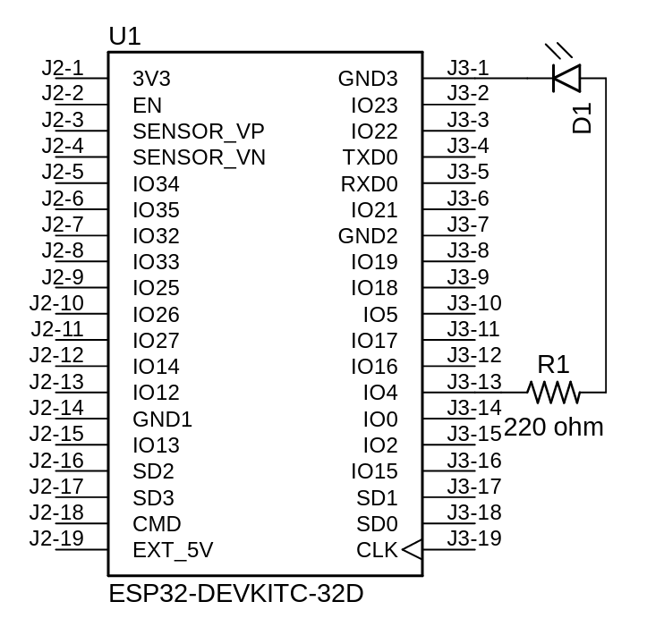
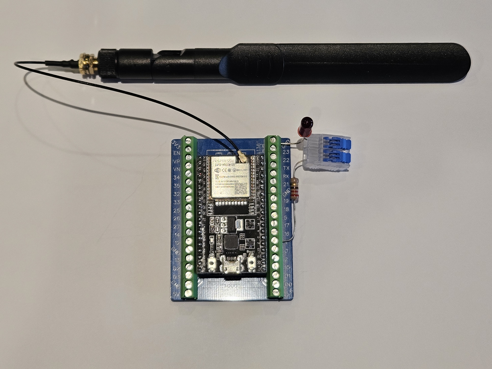
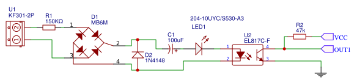
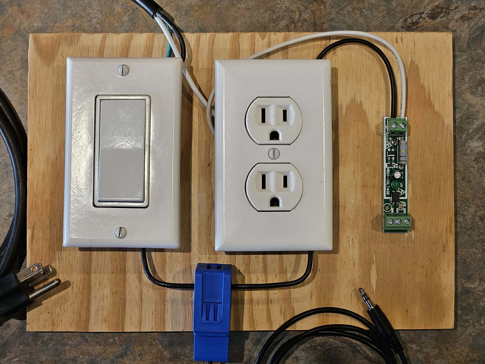
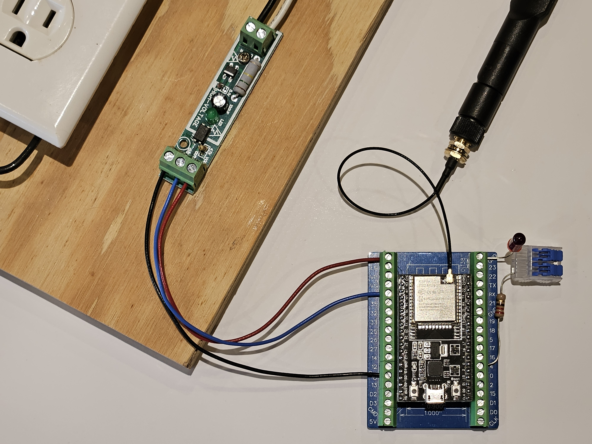
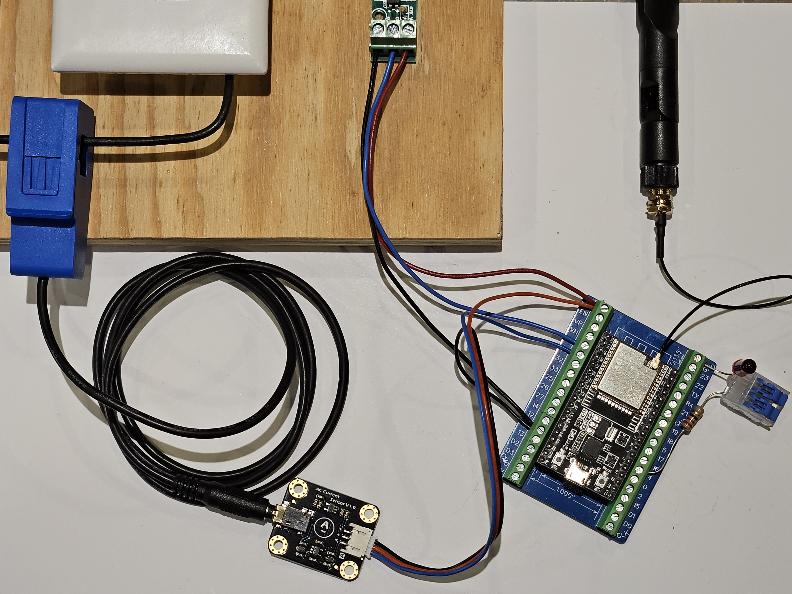

# Aerobic Septic System Monitor

**Table of Content**

[TOC]

## Overview

Recently I had an incident where sewer gas had forced it's way into the house. Among the question of how this happened was the obvious question "Is the aerobic septic system working?" Having recently found the joy of IoT that the ESP8266 and ESP32 bring with the ease of programming like an Arduino and simplified connection to Wi-Fi and the Internet I thought "My dishwasher, pet feeder, vacuum, and light switches are all connected to the Internet, why not my septic system!"

Thus the birth of this project which will look at monitoring an existing mechanical system (AC sensing), logging usage data and alerting system failures all through a Wi-Fi Internet connection. 

### What is an Aerobic Septic System

An an Aerobic Septic System, also referred to as an Aerobic Wastewater Treatment System, is a small-scale sewage treatment system similar to a septic tank, but which uses an aerobic process (adding air or oxygen) for digestion rather than the anaerobic (without air) process used in septic systems.

Adding air promotes the growth of organisms that break down the solids, which are put through a clarifier and chlorinated for disinfection which produces a cleaner, more environmentally friendly discharge. This cleaner discharge eliminates the need for a drainage field (leach field) allowing the system to be installed on a small property where a standard septic tank system would not have been possible. Ref: [Aerobic Septic Systems Explained - JT Septic Co - NE Oklahoma Septic Experts](https://jtsepticco.com/aerobic-septic-systems/)

### Components

The first and obvious thing you are going to need is an ESP32 board. I chose to go with a development board as they are easy to prototype with, exposing all the pins along with a USB-UART bridge, reset- and boot-mode buttons, an LDO regulator and a micro-USB connector. I chose a ESP32-WROOM-32U. The U designates an external IPEX MHF4 antenna connector. While my aerobic septic control box (timers, alarms, etc.) is mounted on the house relatively close to the WiFi router many control boxes get mounted far from the house (100-200ft) at the aerobic tank.  An external antenna in the design made more sense since I was still dealing with a a reasonable distance from the router and a concreate wall.  Better safe, than sorry.

For an antenna I purchased a simple 8dBi antenna with a IPEX MHF4 to RP-SMA female pigtail cable that allowed for through hole mounting of the RP-SMA connector such that the antenna can be mounted outside a waterproof enclosure box. if you need more range I would suggest that you look at using a high gain Yagi directional antenna which can go up to 20dBi.

While building a PCB to mount the ESP32 and other components was appealing, this project is a prototype and many of the sensor components are not designed well to place on a PCB board. So, I decided it would be best to make all connections to the ESP32 through a breakout board. This will also make the design more modular should a component need to be replaced.  Remember, I'm connecting sensors to AC circuits which are much more susceptible to power surges (i.e. lighting!).

Note that not all ESP32 development boards are equal when it comes to board width pin spacing. Some come in a 0.9" pin spacing, while others in a 1.0" pin spacing.  The HiLetgo board I chose comes in a 1.0" pin spacing. Not realizing this and thinking that spacing was the same for all development boards I initially bought a breakout board with the smaller 0.9" pin spacing. The one suggested in following parts list will accept both the 0.9" and 1.0" pin spacing.

The basic function of this project is to measure if the power is on/off and if the pump is actually running.  To determine if the power is on (i.e. the timer has switched on) I found some 220V optocoupler modules that can output a 3-5 volt TTL (digital) signal.  Connected to any GPIO (general-purpose input/output) pin you get 0 for on and 1 for off. 

While the power may be turned on, there is no guarantee that the pump is actually running since the pump circuit contains a low water level float switch designed to turn the pump off when the tank is empty. This means that I have to monitor the current flow in the circuit to determine if the pump is really running. I originally chose a cheaper current sensor that only measures 0-5 amps as I didn't care about what the current was, I only needed to know current was being pulled.  Turns out cheaper is not always better and after hours of trying to get a reading I decided to go with a current sensor that could read a full 20 amp range. The better sensor will also allow me to monitor the pump motor health by specifying an operational current range which could be used to indicate problems like a clogged intake or sprinkler outlet.

To log data I will need an SD card and real-time clock(RTC) to correctly timestamp the data. An Arduino compatible SD card reader with a SPI interface are extremity easy to find , as well as an I2C DS3231 real-time clock module. The real-time clock module suggested below also contains an AT24C32 EPROM memory chip which I will need to store things like the Wi-Fi SSID/password and administrator users/passwords. If you don't buy a RTC with a memory chip you can add a separate memory module.

While it's not necessary I thought it would be nice to add an OLED display. These are small, cheap and run on I2C. For this project the plan is to display things like the IP address (maybe even a QR code) and other useful status Information for when you open the enclosure to check/program.

To power the ESP32 and added modules I will need a USB wall charger and cable. The plan is to run power into the added enclosure using an extension cord with the female plug side in the box and male plug side cut off and spliced into the aerobic system power terminals. This way any standard USB wall charger can be plugged in to the female plug. The reason for the 6 foot cable is that it allows you to walk out to the septic system with your laptop and plug into ESP32 to diagnose and/or program as needed.

#### Parts List

| Quantity | Description                                                  | Source Suggestion                                            |
| -------- | ------------------------------------------------------------ | ------------------------------------------------------------ |
| 1        | ESP32 Development Board                                      | [Amazon.com: HiLetgo 2pcs ESP32-DevKitC ESP32-WROOM-32U Core Board ESP32 ESP-32 ESP-WROOM-32U Development Board for Arduino : Electronics](https://www.amazon.com/dp/B09KLS2YB3?psc=1&ref=ppx_yo2ov_dt_b_product_details) |
| 1        | Antenna                                                      | [Amazon.com: 2 x 8dBi WiFi RP-SMA Male Antenna 2.4GHz 5.8GHz Dual Band +2 x 15CM U.FL/IPEX to RP-SMA Female Pigtail Cable for Mini PCIe Card Wireless Routers, PC Desktop, Repeater, FPV UAV Drone and PS4 Build : Electronics](https://www.amazon.com/dp/B07R21LN5P?psc=1&ref=ppx_yo2ov_dt_b_product_details) |
| 1        | Breakout Board                                               | [Amazon.com: naughtystarts for ESP32 Breakout Board 3.5mm / 0.14" Terminal GPIO Expansion Board for 0.9" / 1.0" Size ESP32 Module ESP-WROOM-32 ESP32-DevKitC (Pack of 2pcs) : Electronics](https://www.amazon.com/dp/B0BYS6THLF?psc=1&ref=ppx_yo2ov_dt_b_product_details) |
| 4        | 220V Optocoupler Module                                      | [HiLetgo AC 220V Optocoupler Module AC Optocoupler Alternating Current Detect Module 3-5V or PLC 24V Level Power for PLC MCU(1 Channel): Amazon.com: Industrial & Scientific](https://www.amazon.com/HiLetgo-Optocoupler-Alternating-Current-Channel/dp/B0CHJLYY3D/ref=sr_1_4?crid=3NMY4ZOHAL63&keywords=220V%2BOptocoupler%2BModule&qid=1707616569&s=industrial&sprefix=220v%2Boptocoupler%2Bmodule%2Cindustrial%2C115&sr=1-4&th=1)<br />[Amazon.com: JESSINIE 3Pcs 1Channel AC 220V Optocoupler Module 220V Voltage Detect 220V Optocoupler Isolation Microcontroller TTL Level 3V-5V : Industrial & Scientific](https://www.amazon.com/dp/B0C73GGKHX?psc=1&ref=ppx_yo2ov_dt_b_product_details) |
| 1        | Current Sensor                                               | [Gravity: Analog AC Current Sensor (20A) - DFRobot](https://www.dfrobot.com/product-1486.html)<br />[Gravity Analog Ac Current Sensor - SEN0211 (electromaker.io)](https://www.electromaker.io/shop/product/gravity-analog-ac-current-sensor)<br />[Amazon.com: Gravity: Analog AC Current Sensor (20A) - AC Current Signal Conversion Module and Open Type AC Transformer Probe Included - Non-contact Measurement : Industrial & Scientific](https://www.amazon.com/Gravity-Conversion-Transformer-Non-contact-Measurement/dp/B0834T9T7M/ref=sr_1_1?crid=37R01SIE984NI&dib=eyJ2IjoiMSJ9.pQZF_7XWzg2r8BOWxppsEw.fQGJyUnb38UZE81QAZmL_Af6NJ-5q_uVt92-crwQPYU&dib_tag=se&keywords=SEN0211&qid=1711410513&sprefix=sen0211%2Caps%2C100&sr=8-1&th=1) |
| 1        | SD Card Reader                                               | [Amazon.com: UMLIFE Micro SD SDHC TF Card Adapter Reader Module with SPI Interface Level Conversion Chip Compatible with Arduino Raspberry PI 10pcs : Electronics](https://www.amazon.com/gp/product/B0989SM146/ref=ppx_yo_dt_b_asin_title_o00_s00?ie=UTF8&psc=1) |
| 1        | SD Card (32GB or less)                                       | [Amazon](https://www.amazon.com/), [DigiKey](https://www.digikey.com/), or [Mouser Electronics](https://www.mouser.com/) |
| 1        | Real-Time Clock w/EEPROM Memory                              | [Amazon.com: HiLetgo 5pcs DS3231 AT24C32 Clock Module Real Time Clock Module IIC RTC Module for Arduino Without Battery : Industrial & Scientific](https://www.amazon.com/dp/B00LX3V7F0?psc=1&ref=ppx_yo2ov_dt_b_product_details) |
| 1        | CR2032 Battery                                               | [Amazon](https://www.amazon.com/), [DigiKey](https://www.digikey.com/), or [Mouser Electronics](https://www.mouser.com/) |
| 1        | EEPROM Memory (only necessary if the real-time clock module does not include memory) | [EC Buying 5Pcs AT24C02 Module I2C IIC Interface EEPROM Memory Module Intelligent Car Accessories with Dupont Wire at Amazon.com](https://www.amazon.com/dp/B0C73CRV1G?ref=ppx_yo2ov_dt_b_product_details&th=1) |
| 1        | Display (optional)                                           | [Amazon.com: Frienda 10 Pieces I2C OLED Display Module OLED Display Screen Driver IIC I2C Tabellone Seriale con Display Auto-Luminoso Compatible with Arduino/Raspberry PI : Electronics](https://www.amazon.com/dp/B08VNRH5HR?ref=ppx_yo2ov_dt_b_product_details&th=1) |
| 1        | USB Wall Charger                                             | [Amazon.com: (3 Pack) USB C Wall Charger, Dual Port PD Power Adapter Fast Charging Block for iPhone 15/15 Pro/15 Pro Max/15 Plus/14/13/12/11,X, Pad, Google Pixel, Samsung Galaxy and More : Cell Phones & Accessories](https://www.amazon.com/dp/B0BDWYL28S?ref=ppx_yo2ov_dt_b_product_details&th=1) |
| 1        | 6' USB Cable                                                 | [Amazon.com: AILKIN Micro USB Cable, 5-Pack 6ft High Speed Nylon Braided Android Charging Cables for Samsung Galaxy J8/J7/S7/S6/Edge/Note5, Sony, Motorola, HTC, LG Android Tablets and More USB to Micro USB Cords : Electronics](https://www.amazon.com/dp/B071H25C43?ref=ppx_yo2ov_dt_b_product_details&th=1) |
| 1        | 220 Ω 1/4W Resistor (optional, beta testing)                 | [Amazon](https://www.amazon.com/), [DigiKey](https://www.digikey.com/), or [Mouser Electronics](https://www.mouser.com/) |
| 1        | 5mm LED (optional, beta testing)                             | [Amazon](https://www.amazon.com/), [DigiKey](https://www.digikey.com/), or [Mouser Electronics](https://www.mouser.com/) |

### Visual Studio Code

While the [Arduino IDE 2](https://docs.arduino.cc/software/ide-v2/tutorials/getting-started-ide-v2/) has come a long way from what is now referred to as the Arduino Legacy IDE or Arduino IDE 1, a lot of developers including myself prefer to use VS Code, short for [Visual Studio Code](https://code.visualstudio.com/). VS Code is an extremely versatile editor that through the implementation of extensions can work across multiple languages and platforms. To use VS code you will need to install the [Arduino](https://marketplace.visualstudio.com/items?itemName=vsciot-vscode.vscode-arduino) extension. You might also want to look at the [PlatformIO IDE for VS Code](https://platformio.org/) extension.

## Beta Testing

The beta testing chapter is a look at each of the different components that make up the Aerobic Septic System Monitor. Each section is an exercise in connecting and programming a component.  If you are new to the Arduino/ESP32 you will want to work through each section to gain a better understanding of each component attached to the ESP32. This chapter is optional and if you want to get directly to monitoring your aerobic septic system you can jump to "v1.0 The Basics".

### Blink (ESP32)

If you are new to the Arduino/ESP32 world, blink is the classic "Hello World!" program for the Arduino developer.  This exercise involves using the build-in LED on pin 13 of many Arduino boards or wiring to an LED to an one of the many digital pins with a 220 ohm ballast resistor to limit the current flow. Then loading a program, in the Arduino world know as a sketch that causes the LED to blink. The following is a wiring example for attaching an LED.



I my case, I used the breakout board and an Ideal Lever Wire Connector to connect the LED and 220 ohm resistor without the need to solder.

| ESP32   | LED         | 220 ohm Resistor |
| ------- | ----------- | ---------------- |
| GND (-) | Cathode (-) |                  |
|         | Anode (+)   | Lead             |
| GPIO 4  |             | Opposite Lead    |



The blink sketch is includes in this project in the folder labeled ```/Blink```.  With the ESP32 Development Board I chose there is no built in LED so I had to manually redefine the LED_BUILTIN constant in the code. In my case I used pin 4. If you are new to programming an Arduino/ESP32 I recommend starting by reading "[Getting Started with Arduino IDE 2](https://docs.arduino.cc/software/ide-v2/tutorials/getting-started-ide-v2/)". You can also search the internet for "Arduino blink" or "programming the Arduino" to find a great deal of articles and tutorials.

### Beyond Blink (ESP32)

Beyond Blink is an exercise to look at the simplicity and power the ESP32 has when it comes to connecting to your Wi-Fi network and the Internet. The code was adapted from the [Last Minute Engineers - Learn Electronics the Easy Way](https://lastminuteengineers.com/) article [In-depth: Create A Simple ESP32 Web Server In Arduino IDE (lastminuteengineers.com)](https://lastminuteengineers.com/creating-esp32-web-server-arduino-ide/) and demonstrated how to connect your ESP32 to a Wi-Fi network hosing a web page that presents a button that can be used to turn the LED on and off.

This exercise uses the same wired LED from the Blink exercise. You will again need to edit the code to modify LED_BUILTIN if you are using a pin other than 4 for the LED. You will also need to edit the ```configuration.h``` header file to add your Wi-Fi SSID and password. The code can be found in the ```/BeyondBlink``` folder.

### Is the Power On (220V Optocoupler Module)

As part of this project I need to be able to see if the power is on. In particular, I want to monitor the pump timer, the air compressor pump timer, the high water alarm and the air compressor alarm.




To do this I will use a simple [220V optocoupler module](https://www.amazon.com/HiLetgo-Optocoupler-Alternating-Current-Channel/dp/B0CHJLYY3D/ref=sr_1_4?crid=3NMY4ZOHAL63&keywords=220V%2BOptocoupler%2BModule&qid=1707616569&s=industrial&sprefix=220v%2Boptocoupler%2Bmodule%2Cindustrial%2C115&sr=1-4&th=1) (pictured above) which can be connected to the hot 120V lead ('L' for load, typically a black wire) of any of the items I previously listed and common ('N' for neutral, typically a white wire) on one side of the module. On the other side I connect the module to 3.3 voltage (VCC - positive voltage), ground (GND - ground, negative) and one of the GPOI (General-Purpose Input-Output) pins of the ESP32 (OUT - signal). You can learn more about the ESP32 GPOI pins at [ESP32 Pinout Reference: Which GPIO pins should you use? | Random Nerd Tutorials](https://randomnerdtutorials.com/esp32-pinout-reference-gpios/). Below is a diagram for a test circuit. 

| 220V Optocoupler Module | ESP32       |
| ----------------------- | ----------- |
| VCC                     | 3V3 (+3.3V) |
| GND                     | GND (-)     |
| OUT (signal)            | GPIO 34     |


The following is a photo of the AC circuit test board I built for testing based on the test circuit above. When plugged in and the the switch is on, the plug has power and the optocoupler module (green PCB (Printed Circuit Board), far right) will sense voltage. In the next module I will discuss the current sensor (blue PCB, bottom).

 

The code can be found in the ```/IsThePowerOn``` folder and is extremely simplistic. Basically when power is sensed the LED I wired in the previous exercises is turned on and a message is sent to the serial port.  As before you will need to change the ```LED_BUILTIN``` constant if you use a pin other than GPIO 4.  You will also need to change the ```POWER_ON_OPTOCOUPLER_MODULE``` constant if you us a GPIO pin other than 34. In the photo below VCC on the optocoupler is wired to 3V3, OUT to GPIO pin 34 and GND to GND on the development breakout board.



### Is the Pump Running (Current Sensor)

While determining if the pump has been turned on by either the pump timer or the high water override float is a simple mater of using a 220V optocoupler module to detect voltage, I can't always be certain that the pump is running since a low water float is tied directly to the pump circuit after the control box wiring. The low water float is wired in to the circuit to keep the pump from running and possibly burning out when there is no water in the septic clear water tank. 

Now I could loop back a wire from the low water float/pump connection and wire it to a 220V optocoupler module to determine if the pump was running, but depending on the distance of the control box from the pump this could be extremely difficult. Also, since the low water float is most likely wired directly to one of the pump leads it is also most likely connected with a special water proof heat shrink connector which complicates things and making this project more complicating is not an objective.

.jpg)

Using a current sensor that can be easily clipped around the power lead leaving the control box is much easier.  For this reason I chose the [Gravity 20A Analog AC Current Sensor from DFRobot](https://www.dfrobot.com/product-1486.html). I did originally look at using a cheaper current sensor based on the ZMCT103C, but after several hours of trying to get a reading, the fact that it had a 5A maximum, requires 5V to power and did not easily clip on to a wire I moved on to this sensor.

The DFRobot current sensor is easy to clip on to a wire, connect to the ESP32 and the example code was easy to implement with only one hitch discovering that the ESP32 12 bit analog requires you divide by 4096 verses 1024. In the photo below the sensor is connect with the positive lead (+) connected to the ESP32 3.3V (3V3), the negative lead (-) to ground (GND), the signal (A) connected to GPIO pin 35 and the AC transformer probe clipped on to one power lead.

| Gravity 20A Analog AC Current Sensor from DFRobot | ESP32       |
| ------------------------------------------------- | ----------- |
| + (positive)                                      | 3V3 (+3.3V) |
| - (negative)                                      | GND         |
| A (Amperage signal)                               | GPIO 35     |



The code can be found in the ```/IsThePumpRunning``` folder and is based off of the [vendors example code](https://wiki.dfrobot.com/Gravity_Analog_AC_Current_Sensor__SKU_SEN0211_). The LED will blink to indicate activity and the amperage will be displayed on the serial port about once every second. As before you will need to change the ```LED_BUILTIN``` constant if you use a pin other than GPIO 4.  You will also need to change the ```AC_CURRENT_SENSOR``` constant if you us a GPIO pin other than 35.

### Where is my Data (SD Card Reader)

Later in this project we will look at logging data. To do this we will use an SD card. SD cards can store large amounts of data in a file format that can be read by any personal computer. The [SD card reader](https://www.amazon.com/gp/product/B0989SM146/ref=ppx_yo_dt_b_asin_title_o00_s00?ie=UTF8&psc=1) I chose to use is operated on 3.3V and you should note the description on Amazon is incorrect about it operating on 5V. You will find other SD card reader modules that work on 5V which are compatible with 3.3V inputs. I simple chose the 3.3V version to stock my workbench with modules I could use with future ESP32 projects that might run off of batteries.


The SD card reader module communicates using SPI communication protocol. You can connect it to the ESP32 using the default SPI pins.

| SD Card Reader | ESP32       |
| -------------- | ----------- |
| 3V3            | 3V3 (+3.3V) |
| GND            | GND (-)     |
| CS             | GPIO 5      |
| MOSI           | GPIO 23     |
| CLK            | GPIO 18     |
| MISO           | GPIO 19     |


To test the module you will first want to format the micro SD card using your personal computer. Most laptops have an SD card slot you can use with an micro SD card adaptor or you may need to purchase a USB SD card reader. On a Windows machine you will open file manager, select the card and format it as FAT32.

The test code can be found in the ```/WhereIsMyData``` folder and is pulled from the ESP32 SD example code ```SD_Test``` with the ```SD_CS``` set to GPIO pin 5. The following are two good tutorials on using SD card readers with the ESP32.

[ESP32: Guide for MicroSD Card Module Arduino | Random Nerd Tutorials](https://randomnerdtutorials.com/esp32-microsd-card-arduino/)

[In-Depth Tutorial to Interface Micro SD Card Module with Arduino (lastminuteengineers.com)](https://lastminuteengineers.com/arduino-micro-sd-card-module-tutorial/)


### What Time is it? (RTS DS3231)

As part of data logging and determining if the pump timer is correctly set, we need to know what time it is. To do this we will use a real-time clock module (RTC) with the DS3231 RTC chip and an AT24C32 EEPROM chip.


The RTC module communicates using the I2C interface for which the ESP32 has two build in IC2 controllers. The DS3231S RTC chip’s fixed I2C address is 0x68.

| RTC module | ESP32             |
| ---------- | ----------------- |
| GND        | GND (-)           |
| 3V3        | 3V3 (+3.3V)       |
| SDA        | GPIO 21 (I2C SDA) |
| SCL        | GPIO 22 (I2C SCL) |


The test code can be found in the ```/WhatTimeIsIt``` folder and is pulled from the article [In-Depth: Interface DS3231 Precision RTC Module with Arduino (lastminuteengineers.com)](https://lastminuteengineers.com/ds3231-rtc-arduino-tutorial/). You will also need to load the [uRTCLib by Naguissa](https://github.com/Naguissa/uRTCLib). The code can be used to set the chips time and then display the current time. Read the comments in the code for setting the current time.


### Don't Let me Forget (AT24C32)

*** This project is a work in progress. Please click the "Watch" button so you get notification on issues, discussions and pull request in GitHub. If you find a bug, please open an issue. If you have a question or comment please start a discussion. If you like what you see click the "Star" button. And please return in the future to see our progress.*


### Show me (OLED Display)

*** This project is a work in progress. Please click the "Watch" button so you get notification on issues, discussions and pull request in GitHub. If you find a bug, please open an issue. If you have a question or comment please start a discussion. If you like what you see click the "Star" button. And please return in the future to see our progress.* 

## v1.0 The Basics

*** This project is a work in progress. Please click the "Watch" button so you get notification on issues, discussions and pull request in GitHub. If you find a bug, please open an issue. If you have a question or comment please start a discussion. If you like what you see click the "Star" button. And please return in the future to see our progress.* 

## v2.0 Logging

*** This project is a work in progress. Please click the "Watch" button so you get notification on issues, discussions and pull request in GitHub. If you find a bug, please open an issue. If you have a question or comment please start a discussion. If you like what you see click the "Star" button. And please return in the future to see our progress.* 

## v3.0 Alerting

*** This project is a work in progress. Please click the "Watch" button so you get notification on issues, discussions and pull request in GitHub. If you find a bug, please open an issue. If you have a question or comment please start a discussion. If you like what you see click the "Star" button. And please return in the future to see our progress.* 
